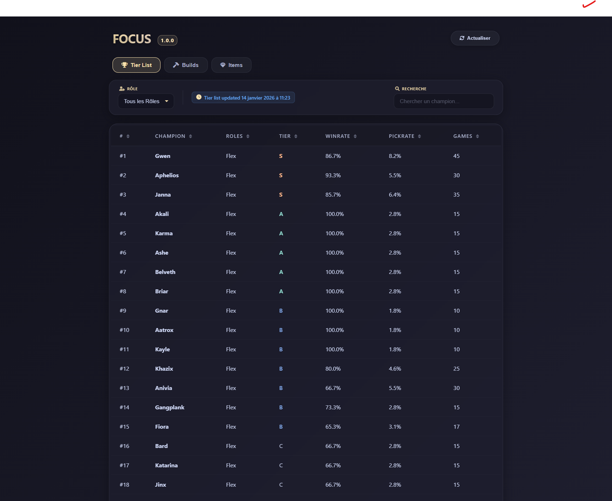

# FOCUS - League of Legends Companio

> A modern desktop application for viewing champion builds, tier lists, and item data for League of Legends.

[](https://www.python.org/)
[](LICENSE)
[]()

## Features

- **Live Tier List** - Diamond+ champion rankings with winrates and pickrates
- **Champion Builds** - Optimized runes, items, skill orders, and summoner spells
- **Items Database** - Browse all items with stats and gold efficiency
- **Modern UI** - Clean Catppuccin Mocha theme with glassmorphism effects
- **Fast & Lightweight** - Built with Python Eel framework
- **Smart Caching** - Color-coded cache indicators for data freshness

## Screenshots




## Installation

### Prerequisites

- Python 3.8 or higher
- pip (Python package manager)

### Quick Start

```bash
# Clone the repository
git clone https://github.com/milanhommet/FocusAPP.git
cd FocusAPP

# Install dependencies
pip install -r requirements.txt

# Run the application
python app.py
```

### Build Executable (Optional)

```bash
# Install PyInstaller
pip install pyinstaller

# Build standalone executable
pyinstaller app.spec
```

## Usage

1. **Launch the application** - Run `python app.py`
2. **Browse Tier List** - View Diamond+ champion rankings
3. **Search Champions** - Filter by role or search by name
4. **View Builds** - Select a champion and role to see optimal builds
5. **Refresh Data** - Click refresh to get the latest statistics

## Tech Stack

| Component | Technology |
|-----------|------------|
| Backend | Python 3.8+, Eel |
| Frontend | Vanilla JS, HTML5, CSS3 |
| Data Source | [api.hommet.ch](https://api.hommet.ch) (Diamond+ aggregated data) |
| Assets | DDragon, CommunityDragon |
| Theme | Catppuccin Mocha |

## Project Structure

```
FocusAPP/
├── app.py              # Main Eel application entry point
├── api_client.py       # API client for fetching data
├── data_fetcher.py     # Data fetching and formatting
├── riot_api.py         # Riot API utilities (optional)
├── requirements.txt    # Python dependencies
├── web/
│   ├── index.html      # Main HTML page
│   ├── main.js         # Frontend JavaScript
│   └── style.css       # Catppuccin Mocha styles
└── README.md
```

## API Reference

The application uses a custom API that aggregates Diamond+ data:

### Endpoints

| Endpoint | Description |
|----------|-------------|
| `GET /tierlist` | Fetch tier list with all champions |
| `GET /build/{champion}/{role}` | Fetch build for specific champion and role |

### Example Response (Build)

```json
{
  "champion": "jinx",
  "role": "adc",
  "rank": "MASTER",
  "build": {
    "runes": { ... },
    "items": { "core": [...], "boots": 3006, "starting": [...] },
    "skill_order": { "priority": "Q>W>E" },
    "summoner_spells": { "ids": [4, 7] },
    "stats": { "winrate": 52.5, "games_analyzed": 15000 }
  }
}
```

## Configuration

No configuration required! The app automatically:

- Detects the latest game version from DDragon
- Fetches fresh data from the API
- Caches builds for better performance

## Contributing

Contributions are welcome! Please ensure:

1. Code follows PEP 8 (Python) and standard JS conventions
2. All functions have docstrings/JSDoc comments
3. Comments are in English
4. No console.log or debug prints in production code

### Development Setup

```bash
# Install development dependencies
pip install black pylint

# Format code
black . --line-length 100

# Check for issues
pylint *.py
```

## License

This project is licensed under the MIT License - see the [LICENSE](LICENSE) file for details.

## Acknowledgments

- **Data Source**: [api.hommet.ch](https://api.hommet.ch) for Diamond+ aggregated statistics
- **Assets**: Riot Games DDragon and CommunityDragon
- **Icons**: Font Awesome
- **Theme**: [Catppuccin Mocha](https://github.com/catppuccin/catppuccin)

## Disclaimer

FOCUS isn't endorsed by Riot Games and doesn't reflect the views or opinions of Riot Games or anyone officially involved in producing or managing Riot Games properties. Riot Games, and all associated properties are trademarks or registered trademarks of Riot Games, Inc.

---

Made with love by [Milan Hommet](https://github.com/milanhommet)
